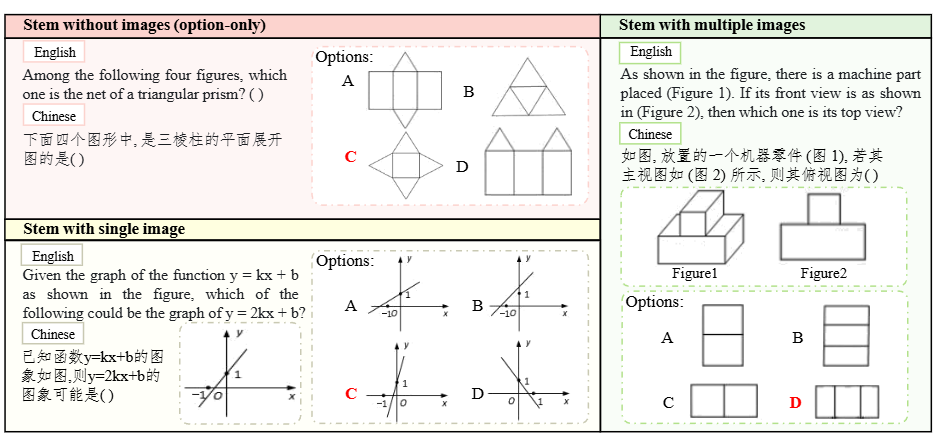
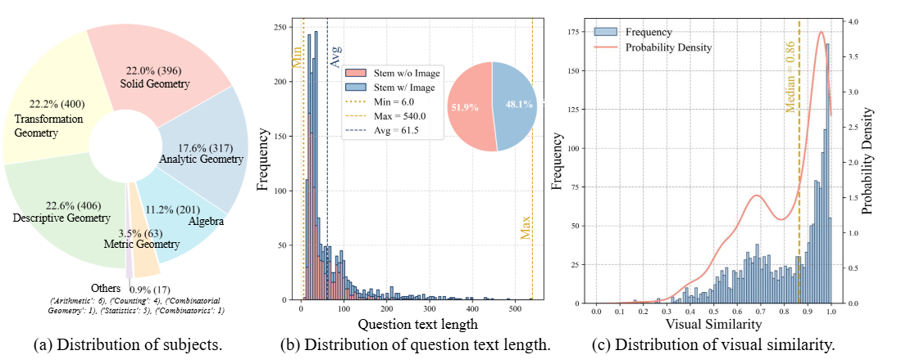
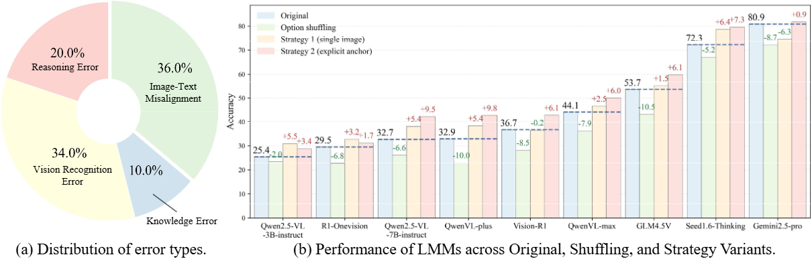

# VisioMath:Benchmarking Figure-based Mathematical Reasoning in LMMs (ICLR 2026) 

[](#)

**VisioMath** is a curated benchmark for **figure-based, multi-image mathematical reasoning** where **all answer choices are diagrams** and distractors are **highly visually similar**—a common setting in real-world K–12 exams. The benchmark is designed to stress-test **fine-grained comparative reasoning** and **multi-image–text alignment** in Large Multimodal Models (LMMs).


---

## 🔥 Introduction

LMMs have achieved strong progress on many vision-language tasks, yet **reasoning over multiple, highly similar images** remains underexplored and surprisingly difficult. In real K–12 exam settings, a large portion of multiple-choice math problems present **diagrammatic answer options** (e.g., geometry figures, function graphs) that differ only in subtle visual details. Solving such problems requires:
- **Fine-grained visual discrimination** among near-duplicate candidates
- **Comparative reasoning** across multiple images
- **Precise option-to-image grounding (image–text alignment)**, rather than positional heuristics

VisioMath is built to faithfully capture this setting.

<!-- [FIGURE | PDF] Figure 1: Dataset examples (highly similar visual options; stem may include 0/1/multiple images) -->


---

## ✨ Key Features

- **Image-option math reasoning**: all A–D options are *independent images* (one image per option).
- **Multi-image input**: each problem contains option images + optional stem image(s).
- **High visual similarity distractors**: options are intentionally confusable to test fine-grained discrimination.
- **Alignment stress-test**: controlled experiments reveal models’ reliance on shallow positional priors.


---

## 🔥 Comparisons with Existing Benchmarks

Most multimodal math benchmarks follow a **single-image** setting (one diagram + text options). Multi-image benchmarks exist, but often **lack figure-based options** or provide options in **composite layouts** rather than independent, semantically meaningful images. VisioMath explicitly targets the underexplored but ubiquitous “**image-option**” exam scenario.


---

## 📦 Dataset overview

- **#Problems:** 1,800 high-quality K–12 math multiple-choice questions  
- **#Option images:** 8,070 (strictly **one image per option**, cropped and cleaned)
- **Avg. images per problem:** 4.48 (options + optional stem images)
- **Languages:** Chinese & English (bilingual stems available for many questions)
- **Source:** real Chinese high school & college entrance exam questions (2002–2023)

- **Visual similarity:** quantified by the **minimum pairwise cosine similarity** across option image embeddings (computed via a diagram-friendly multimodal embedding model)


<!-- [FIGURE | PDF] Figure 3: Dataset statistics (subjects, question length, similarity distribution) -->



---

## 🧪 ANALYSIS

### Error taxonomy
A representative error analysis categorizes model failures into:
- Vision recognition errors
- Reasoning errors
- Knowledge errors
- **Image–text misalignment** (often the largest share)

### Option shuffling diagnostic
To test reliance on positional priors, we keep image order fixed but permute the textual option-to-image mapping. Performance drops consistently under this manipulation, indicating that many models do not robustly bind “Option A/B/C/D” to the correct image.


---

## 🧪 STRATEGIES FOR PERFORMANCE ENHANCEMENT

We provide three alignment-oriented strategies:

### Strategy 1: Consolidated single-image layout (training-free)
Concatenate all stem/option images into one composite image to simplify attention distribution.

### Strategy 2: Explicit visual–textual anchors (training-free)
Add a visible label (A/B/C/D) directly onto each option image to strengthen the option-to-image correspondence.

### Strategy 3: Alignment-oriented multi-image CoT fine-tuning (training-based)
Construct a specialized multi-image CoT dataset with explicit per-image descriptions and aligned reasoning traces, then fine-tune models with SFT. Even small amounts of such data yield strong gains.


---

## 📦 Core Modules

1. `function.py` - Core functionality:
   - Strategy 1 and strategy 2 (image formatting / stitching / anchors)
   - Answer extraction and evaluation
   - JSON data handling
   - Accuracy calculation

2. `test.py` - Evaluation framework:
   - Main execution flow
   - Batch processing with periodic saving
   - Result aggregation

3. `cot_data_gen.py` - Data Generation:
   - Generate multi-image CoT data (for Strategy 3)
   - Option shuffling prompt / augmentation utilities

---

## 🚀 Getting started

### 1) Environment
```bash
pip install -r requirements.txt
````

### 2) Prepare data

unzip the data/image.zip

### 3) Configure API keys (if using closed-source APIs)

Edit `function.py` and set the required keys / endpoints.

### 4) Run evaluation

```bash
python test.py
```

Results will be saved to `baseline.json`.


---

## 📝 Citation

If you use VisioMath in your research, please cite:

```bibtex
@inproceedings{li2026visiomath,
  title     = {VisioMath: Benchmarking Figure-based Mathematical Reasoning in LMMs},
  author    = {Li, Can and Liu, Ying and Zhang, Ting and Wang, Mei and Huang, Hua},
  booktitle = {International Conference on Learning Representations},
  year      = {2026}
}
```
